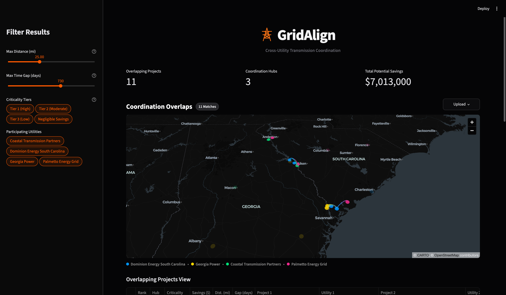
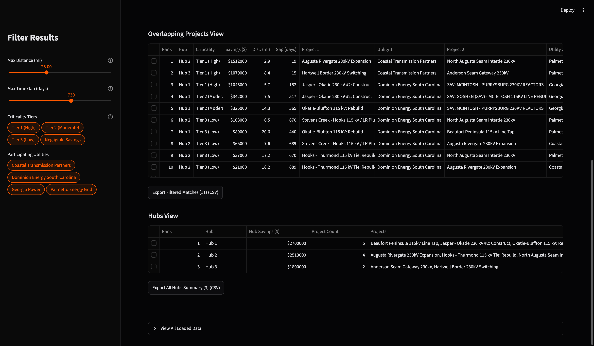
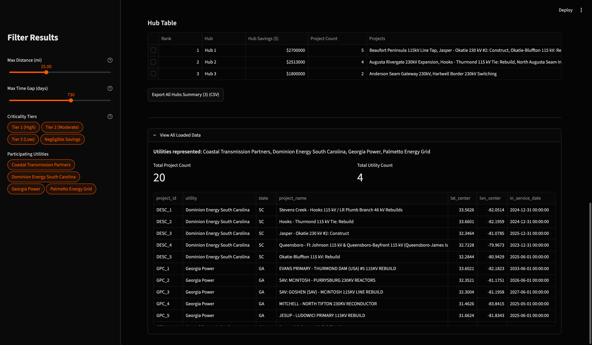

# GridAlign

**Cross-Utility Transmission Coordination Platform**

A coordination dashboard for regional power grid planning. GridAlign identifies overlapping capital projects across neighboring electric utilities and calculates the cost savings from pooling staging yards, equipment, and labor.

[gridalign.streamlit.app](https://gridalign.streamlit.app)

---

## Screenshots & Demo





[Watch the Demo Video](https://youtu.be/NXdtBrgQD1Q)

---

### Key Features

- **Interactive Geospatial Map:** Built with PyDeck to map transmission corridors across utility boundaries. Selecting a project or regional hub dynamically shifts the camera focus and isolates connected lines.
- **Regional Hub Clustering:** Groups applicable projects into regional clusters (3+ overlapping projects) so utilities can share resources across several projects to maximize savings.
- **Cost-Savings Estimation:** Determines the total amount saved from sharing equipment and labor from a baseline mobilization cost, decaying realistically across distance (up to 25 miles) and schedule separation (up to 2 years), with non-linear scaling for multi-project clusters.
- **Custom Data Upload:** Import datasets in CSV or Excel formats to immediately map and compare projects.
- **CSV Export:** One-click CSV export of hub groupings, project pairings, and cost breakdowns ready for project coordination.

---

## Cost Model & Methodology

Savings calculations are grounded in transmission construction benchmarks (FERC Form 1 and EPRI data):

- **Thresholds:** Projects qualify for coordination if separated by $\le$ 25 miles (Haversine distance) and $\le$ 730 days (target in-service date separation).
- **Baseline Mobilization ($1.8M):** Derived from standard staging costs—heavy crane hauling, tensioning rigs, and laydown yards—which account for 6%–10% of CapEx on typical 115/230 kV builds.
- **Distance Decay ($d^{1.2}$):** Non-linear penalty. Peak savings occur under 10 miles; savings drop off steeply past 15 miles as crew transit time and DOT oversize hauling permits compound, hitting zero at approximately 25 miles.
- **Timeline Decay ($\Delta t^{1.0}$):** Linear penalty based on monthly equipment lease carrying costs. Maximum savings occur within 180 days; gaps beyond 2 years require full contractor demobilization.
- **Multi-Cluster Multiplier ($1.25\times$ – $1.55\times$):** Hubs with 3+ projects earn a scale bonus for bulk material procurement (conductor spools, steel poles) and zero-downtime crew handoffs across adjacent rights-of-way. However, there are diminishing returns on savings as the number of projects increases.

---

## Tech Stack

- **Language**: Python 3.14.3
- **Frontend / UI**: Streamlit
- **Geospatial Visualization**: PyDeck (Deck.gl)
- **Data Processing**: Pandas, OpenPyXL

The application architecture follows a modular, production-ready structure separating constants (`constants.py`), data logic (`logic.py`), UI rendering (`components.py`), and state orchestration (`app.py`).

---

## Local Setup

### Prerequisites

- Python 3.10+

### Installation

1. **Clone repository:**

   ```bash
   git clone https://github.com/sheehanr/gridalign.git
   cd gridalign
   ```

2. **Install dependencies:**

   ```bash
   pip install -r requirements.txt
   ```

3. **Run the Streamlit App:**
   ```bash
   streamlit run app.py
   ```

---

## Datasets

GridAlign was built primarily using the dataset provided by Sperry Tech for the ShellHacks 2026 Gridlock Challenge found in `data/Projects_Overlaps.xlsx`. Additional mock data was generated with the schema of this dataset to simulate a third and fourth utility.

---

## Data Schema

GridAlign accepts uploads of `.csv` and `.xlsx` datasets with the following required columns (matching the columns of the provided dataset):

- `project_id` (Unique identifier)
- `utility` (Name of the utility company)
- `project_name` (Name of the transmission project)
- `lat_center` (Latitude coordinates)
- `lon_center` (Longitude coordinates)
- `in_service_date` (Target completion date)

---

Built at **ShellHacks 2026** for the **Sperry Tech Gridlock Challenge**
